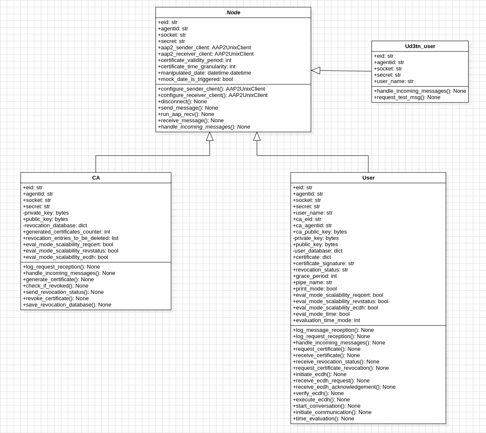
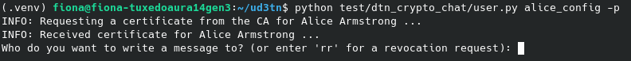
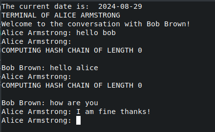
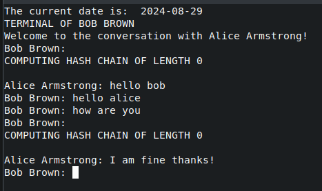

# DTN Chat Application

This project implements a terminal-based chat application that facilitates secure communication between users. The application serves as a proof of concept for **BERMUDA** (**B**PSec-Compa­tible Key **E**stablishment and **R**evocation **M**echanism for **U**nicast **M**essaging in **D**elay-tolerant **A**pplications), a key management system designed for Delay- and Disruption-Tolerant Networks (DTNs).

BERMUDA employs a Public Key Infrastructure (PKI) for certificate handling, combined with Elliptic-Curve Diffie-Hellman (ECDH) key exchange and the [NOVOMODO](https://citeseerx.ist.psu.edu/document?repid=rep1&type=pdf&doi=3d2bb4a0ef5d0035f97562b387fb4e961b1c641b) revocation mechanism.

This application is strictly a scientific prototype and is not production-ready.

## Prerequisites

This application is designed to run on a **Linux** system. Specifically, this prototype was tested on **Ubuntu 22.04 LTS** and the setup instructions in this repository assume an **Ubuntu-based** environment.

The DTN chat application relies on the lightweight Bundle Protocol implementation, [µD3TN](https://d3tn.com/ud3tn.html), for basic sending and receiving functions. The µD3TN-specific documentation can be found [here](https://d3tn.gitlab.io/ud3tn/).

### Installation

To get started with this project, first, clone the repository and set up µD3TN:

```
git clone --recursive https://github.com/raniya02/dtn_crypto_chat.git
cd dtn_crypto_chat/ud3tn
make posix
cd ..
```

### Dependencies

For detailed information on µD3TN dependencies, please refer to the [µD3TN documentation](https://d3tn.gitlab.io/ud3tn/posix_quick_start_guide/#prerequisites).

Additionally, the application requires **gnome-terminal**. If not installed, you can install it using the following commands:

```
sudo apt update
sudo apt install gnome-terminal
```

You can verify the installation with:

```
gnome-terminal --version
```

The application also requires the following Python packages:

- `cryptography`
- `psutil`

You can install them using `pip`. It's recommended to do so within a virtual environment to avoid installing packages system-wide.

```
pip install cryptography psutil
```

Further generalization for compatibility with more operating systems and terminal applications has been deferred to future work.

## Overview

### File Structure

The following is the directory structure of the DTN chat application:

```
.
├── scripts/                         // Contains all shell scripts
│   ├── revoke_certificate.sh        // Script for the CA to revoke certificates
│   ├── scal_ca.sh                   // Scalability evaluation logic for the CA
│   ├── scal_receiver.sh             // Scalability evaluation logic for a user
│   ├── scal_user.sh                 // Creates multiple users for scalability evaluation
│   ├── send_revocation_status.sh    // Triggers CA to send revocation status
│   │                                 // updates to all users in the system
│   └── test_setup.sh                // Sets up necessary µD3TN instances/contacts
│
├── src/                            // Contains all Python files
│   ├── ca.py                       // Logic for the Certificate Authority
│   ├── communication.py            // Handles chat communication between users
│   ├── generate_CA_keys.py         // Generates Ed25519 key pair for the CA
│   ├── node.py                     // Abstract base class for users and the CA
│   ├── user.py                     // Logic for regular users in the application
│   ├── user_no_km.py               // Simulates communication without any key
│   │                                 // management mechanism employed
│   └── utils.py                    // Defines utility functions
│
└── ud3tn/                           // µD3TN submodule
```

There is no central entry point for the application. However, to set up all necessary µD3TN instances and contacts during normal execution (i.e. not for evaluation purposes), run `test_setup.sh` before executing other scripts.

### Class Diagram

The DTN Chat Application is built around three main classes: `Node`, `CA`, and `User`. An additional helper class, `Ud3tn_user`, is used for evaluation purposes. All three classes, `CA`, `User` and `Ud3tn_user`, inherit from `Node`.

This object-oriented design simplifies the setup of multiple user instances with varying properties and lays the groundwork for future enhancements, such as incorporating multiple Certificate Authorities for improved availability (in case a CA fails to operate due to environmental conditions or targeted attacks).



## Example: Simple Chatting Scenario

This example scenario aims to demonstrate how the DTN chat application is used to chat with other users. For the purpose of this example, we are "**Alice Armstrong**". 

***All the following commands are assumed to be executed from the root directory of this repository.***

### Step 1 - Run µD3TN and Start Certificate Authority

Activate the Python virtual environment in the `/ud3tn` directory, switch back to the root directory and run the setup script in **TERMINAL 1**:

```
cd ud3tn && make virtualenv && source .venv/bin/activate && cd ..

./scripts/test_setup.sh
```

To run any Python scripts, it's essential to activate the Python virtual environment. You’ll know the environment is activated when you see `(.venv)` at the beginning of the terminal line.

The `test_setup.sh` bash script performs the following tasks:
- Launches µD3TN instances for the following entities:
	- Certificate Authority (CA)
	- Alice Armstrong (our instance)
	- Bob Brown
	- Carol Clark
- Configures bi-directional contacts using µD3TN's AAP2 protocol between:
	- CA and Alice Armstrong
	- CA and Bob Brown
	- CA and Carol Clark
	- Alice Armstrong and Bob Brown
	- Alice Armstrong and Carol Clark
(Contact between Bob and Carol is omitted since we are Alice, and only user contacts involving us are relevant.)
- Generates a public/private key pair for the CA using the Python script `generate_CA_keys.py`.
- Creates configuration files for each user and the CA for later use:
	- `ca_config.sh`: Used in `revoke_certificate.sh` to revoke certificates
	- `alice_config`: Used in `user.py` to initialize Alice
	- `bob_config`: Used in `user.py` to initialize Bob
	- `carol_config`: Used in `user.py` to initialize Carol
- Starts the CA Python instance via `src/ca.py` and using the generated key pair for the CA.

The exact configuration variables for the CA and each of the three users are as follows:
- **Certificate Authority:**
	- EID: `dtn://ca.dtn/`
	- Agent ID: `ca`
	- Socket: `ud3tn-ca.aap2.socket`
	- AAP port: `5242`
	- MTCP port: `5224`
	- IP address: `localhost`
- **Alice Armstrong:**
	- EID: `dtn://alice-armstrong.dtn/`
	- Agent ID: `alicearmstrong`
	- Socket: `ud3tn-alice.aap2.socket`
	- AAP port: `5243`
	- MTCP port: `5225`
	- IP address: `localhost`
- **Bob Brown:**
	- EID: `dtn://bob-brown.dtn/`
	- Agent ID: `bobbrown`
	- Socket: `ud3tn-bob.aap2.socket`
	- AAP port: `5244`
	- MTCP port: `5226`
	- IP address: `localhost`
- **Carol Clark:**
	- EID: `dtn://carol-clark.dtn/`
	- Agent ID: `carolclark`
	- Socket: `ud3tn-carol.aap2.socket`
	- AAP port: `5245`
	- MTCP port: `5227`
	- IP address: `localhost`

For simplicity, all IP addresses are set to `localhost`, meaning this chat application is intended to run on a single device (for the time being). If you need to test communication between different devices, you’ll need to update the IP addresses in `test_setup.sh` accordingly. Additionally, if the ports used by this chat application are already in use by other services, you’ll need to manually change the port numbers in the script.

As soon as the line `Configuring contact between "Alice" and "Carol" ...` appeared, you can continue with the next step.

### Step 2 - Start all three users: Alice, Bob, and Carol

In separate terminals, activate the Python virtual environment and start the users:

In **TERMINAL 2**, execute the following commands:

```
# Activate the Python virtual environment:
cd ud3tn && make virtualenv && source .venv/bin/activate && cd ..

# Start a User instance with Alice's configuration details:
python src/user.py alice_config
```
*Note: To enable print statements that provide more information, add `-p` or `--print-mode` after `alice_config`*

In **TERMINAL 3**, execute the following commands:

```
# Activate the Python virtual environment:
cd ud3tn && make virtualenv && source .venv/bin/activate && cd ..

# Start a User instance with Bob's configuration details:
python src/user.py bob_config
```
*Note: To enable print statements that provide more information, add `-p` or `--print-mode` after `bob_config`*.

In **TERMINAL 4**, execute the following commands:

```
# Activate the Python virtual environment:
cd ud3tn && make virtualenv && source .venv/bin/activate && cd ..

# Start a User instance with Carol's configuration details:
python src/user.py carol_config
```
*Note: To enable print statements that provide more information, add `-p` or `--print-mode` after `carol_config`*

Although this chat application is aimed to support communication between any users, this specific setup of users should serve as a solid proof of concept.

Upon initialization, each of the three users automatically generates a random public/private key pair and requests a certificate from the CA. Once the CA receives the request, it issues a certificate containing the following information for each user:

- Serial number $SN$
- User identity $ID$ (username)
- User's public key $PK$
- Date of certificate issuance $D_1$
- Date of certificate expiration $D_2$
- Validity hash $X_{365}$ (for a certificate valid for 365 days; related to NOVOMODO)
- Revocation hash $Y_1$ (related to NOVOMODO)

In **TERMINAL 1**, where the CA was started using `test_setup.py`, you should now observe that the CA is computing a hash chain of length 365 for the validity hash $X_{365}$, corresponding to the one-year (365 days) validity period of the certificate.

After receiving the certificate, each user verifies the CA's appended signature and stores the certificate for later authentication.

### Step 3 - Initiating Communication with Bob Brown

If Step 2 was completed successfully, the terminals running the user scripts should now display the following prompt:



When this prompt appears, you can enter the name of your desired communication partner, in this case, "Bob Brown."

```
Who do you want to write a message to? (or enter 'rr' for a revocation request): Bob Brown
```

Press ENTER after typing the name.

Since this is the first time we are communicating with Bob Brown, an ECDH key exchange will be automatically initiated in the background. During this process, Alice will send her certificate and current revocation status to Bob, and Bob will reciprocate with the same information. If both certificates and revocation statuses are valid, a shared secret is computed, which is then used to derive an AES key for encryption.

Given that we just set up Alice and Bob (i.e., their certificates have just been generated), the revocation status will be $X_{365}$, meaning both Alice and Bob only need to compute a hash chain of length 0 to check the validity of the status. This process will be displayed in the terminal if print mode is enabled.

Once the ECDH key exchange is successfully completed, two (*gnome*) sub-terminals will open: one for Alice to communicate with Bob, and one for Bob to communicate with Alice. Note that this feature requires a Linux operating system with gnome-terminal installed to function correctly.

These sub-terminals simulate chat windows, similar to those found in modern chat applications. Alice and Bob can now exchange messages, which will be encrypted and decrypted automatically in the background. Each message will include the sender's current revocation status hash, which will be verified by the receiver.

An example conversation may look like this:





While the hash chain length prints might clutter the interface, they are useful for verifying that the application is functioning correctly. These prints can be removed in future versions for a cleaner user experience.

### Step 4 - Triggering the Revocation Status Sending Process

Originally, the key management system was designed to have the CA automatically send the revocation status to each user at regular intervals, such as daily at 6 PM. However, this automatic process is impractical for testing, so it must be triggered manually.

In **TERMINAL 5**, enter the following commands:

```
cd ud3tn && make virtualenv && source .venv/bin/activate && cd ..

./scripts/send_revocation_status.sh -m chat
```

This bash script operates in two modes: `chat` for regular usage, as in this case, and `evaluation` for testing purposes.

 The script starts a µD3TN instance and establishes a connection between this service instance and the CA. The service instance then sends a specific message to the CA, which triggers the CA to send revocation status updates to each user in the system. In  `chat` mode, it is assumed that the CA's IP address is set to `localhost`. If this is not the case, the correct IP address needs to be manually set in the bash variable `IP_CA` in line 107 of `send_revocation_status.sh`.

If the certificate is generated and the revocation status update is received on the same day, the CA will always have to compute a hash chain of length 365 when calculating the revocation status hash (assuming the certificate's validity period is one year), while the user will have to compute a hash chain of length to verify the revocation status hash. To test the application's functionality with non-zero hash chain lengths for users, a feature to mock the current date is included and triggered in this step. The mocked date is **hard-coded to August 9, 2025**. If a different date needs to be mocked (e.g. if this date is already in the past), you must manually change the `manipulated_date` variable in `node.py` (if the specified date has already passed, it is essential to update this variable). To disable the mocked date functionality, comment in line 60 in `node.py` (`self.manipulated_date = None`) and comment out line 59 (`self.manipulated_date = datetime.datetime(2025, 8, 9)`).

After the revocation status update is successfully received, the new status is also integrated into the ongoing chat between Alice and Bob. All subsequent messages between them will include the updated revocation status until another update is received.

Regarding the hash chain length, the following points are important to note:
1. The CA sends the revocation status for *the next day* to align with the original approach where revocation status updates are sent the evening before the next day, at a specific time each day.
2. In our example, when chatting after receiving the revocation status update, users must calculate two different hash chains with varying lengths:
	- Typically, the user sends the revocation status for the current date with each message. The receiver then calculates the number of days that have passed between the current date and the sender's certificate issuance date to determine the appropriate hash chain length for verifying the sender's status.
	- However, in this slightly simplified approach, the current revocation status is immediately updated with each incoming update from the CA. As a result, if a message is sent on the same day the update is received, the revocation status reflects the following day’s status.
	- As a result, the receiver first verifies the standard case. If the hash is not valid, they then check the second scenario, leading to the computation of two different hash chains.

### Step 5 - Carol Initiates Communication with Us (Alice)

In **TERMINAL 4**, where Carol's user script is running, enter "Alice Armstrong" as the communication partner.

Since this is the first interaction between Carol and us, the request will automatically trigger an ECDH key exchange, which occurs in the background.

Once the two gnome sub-terminals open, Carol and Alice can securely chat with each other. You'll also notice that the mocked date is consistent in this communication, and the hash chain lengths behave as expected.

### Step 6 - Alice Re-initiates Communication with Bob

1. Close the chat windows (gnome sub-terminals) for both Alice and Bob.
2. In Alice's terminal (**TERMINAL 2**), enter "Bob Brown" again.

Just like in real-world chat applications, it’s not practical to keep chat windows open indefinitely. If the chat is closed and Alice wishes to communicate with Bob again, there’s no need for another ECDH key exchange.

A new ECDH key exchange between Alice and Bob is only needed in these scenarios:
- Alice's certificate expired. / Bob's certificate expired.
- Alice's certificate has been revoked. / Bob's certificate has been revoked.

Nonetheless, since the ECDH key exchange is conducted in the background, there is no notable difference for the user whether it is executed or not. As soon as the gnome sub-terminals open again, Alice and Bob can resume their conversation. Note that the previous chat history will not be preserved.

### Step 7 - Revoke Certificates

1. Close all chat windows (gnome sub-terminals) for Alice, Bob, and Carol.
2. **Request revocation of the own certificate:** In Alice's terminal (**TERMINAL 2**), enter "rr" for "***r**evocation **r**equest*":

```
Who do you want to write a message to? (or enter 'rr' for a revocation request): rr
```

A user might request revocation of their own certificate, for example, if they suspect that their private key has been compromised. This is similar to requesting a credit card cancellation to prevent unauthorized use.

When Alice enters `rr`, a message is automatically sent to the CA, which triggers the revocation process. The CA responds by removing Alice’s entry from the revocation database — this database stores the certificate information of all users needed to compute revocation status updates. While in a real-world scenario, this request would require identity verification to prevent malicious revocation requests, this step is omitted in the DTN chat application for simplicity. After initiating the revocation, Alice automatically generates a new public/private key pair and requests a new certificate from the CA. Once issued, the CA adds Alice’s new certificate information to the revocation database.

3. **CA revokes the certificate of a specific user:** In a new terminal (**TERMINAL 6**), enter:

```
cd ud3tn && make virtualenv && source .venv/bin/activate && cd ..
./scripts/revoke_certificate.sh
```

After the prompt appears, enter the name of the user whose certificate the CA should revoke. For example, to revoke Bob Brown’s certificate:

```
Please enter the name of the owner whose certificate should be revoked: Bob Brown
```

At this point, Bob remains unaware that his certificate has been revoked because he hasn't received the revocation status update yet.

### Step 8 - Repeat the Revocation Status Sending Process (Step 4)

In **TERMINAL 5**, enter:

```
./scripts/send_revocation_status.sh -m chat
```

The Python virtual environment should already be active, indicated by `(.venv)` at the beginning of the line. If it's not, you must first enter `cd ud3tn && make virtualenv && source .venv/bin/activate && cd ..` before running the command.

After executing this command, the following actions can be observed:
- Alice’s certificate remains valid, and her computed hash chain has a length of 1, reflecting that the certificate was newly generated after the previous one was revoked (length 1 instead of 0, as the status corresponds to tomorrow).
- Bob's certificate has been revoked, prompting him to immediately request a new one from the CA (although, in reality, Bob would need to undergo identity verification before this request could be fulfilled).
- Carol’s certificate remains valid, with her hash chain length calculated based on the difference between the mocked date and her certificate issuance date (i.e., the same value as in step 4).

It’s important to note that the chat application’s behavior after certificate revocation has not been implemented yet, as this was not necessary for the proof of concept regarding the key management approach.

After completing this step, our example concludes. You can now close all terminals.

## Evaluation

This section explains the use of evaluation scripts included in this project. The implementation offers two primary options for practical evaluations: **scalability evaluation** and **temporal overhead evaluation**.

### Scalability Evaluation

There are three primary scripts used for scalability evaluation: `scal_ca.sh`, `scal_user.sh`, and `scal_receiver.sh`.

#### Script Usage

```
# scal_ca.sh :

Usage: ./scripts/scal_ca.sh -t <TEST_MODE> -u <USER_IP_ADDRESS> [-a <ALICE_IP_ADDRESS>]
 -t  TEST_MODE (mandatory, reqcert/revstatus/sendecdh)  
 -u  USER_IP_ADDRESS (mandatory)  
 -a  ALICE_IP_ADDRESS (required if TEST_MODE is 'sendecdh')
```

```
# scal_user.sh :

Usage: ./scripts/scal_user.sh -t <TEST_MODE> -u <AMOUNT_USERS> -r <AMOUNT_RUNS> -c <CA_IP_ADDRESS> [-a <ALICE_IP_ADDRESS>]
 -t  TEST_MODE (mandatory, reqcert/revstatus/sendecdh)  
 -u  AMOUNT_USERS (mandatory, per second)  
 -r  AMOUNT_RUNS (mandatory, TOTAL_USERS = AMOUNT_USERS (per second) * AMOUNT_RUNS)  
 -c  CA_IP_ADDRESS (mandatory)  
 -a  ALICE_IP_ADDRESS (required if TEST_MODE is 'sendecdh')
```

```
# scal_receiver.sh : 

Usage: ./scripts/scal_receiver.sh -c <CA_IP_ADDRESS> -s <SENDER_IP_ADDRESS>
 -c  CA_IP_ADDRESS (mandatory)  
 -s  SENDER_IP_ADDRESS (mandatory)
```

#### Test Modes

The scalability evaluation offers three modes:

1. **REQCERT**: This mode tests the Certificate Authority (CA)’s ability to handle multiple users requesting certificates simultaneously, by measuring its CPU and memory usage during this procedure.
2. **REVSTATUS**: This mode assesses the CA’s performance in terms of CPU and memory usage when calculating and sending revocation status updates for a specified number of users.
3. **SENDECDH**: This mode evaluates Alice’s capacity to manage multiple simultaneous ECDH key exchange requests from different users, with respect to her CPU and memory usage.

#### REQCERT:

In **TERMINAL 1**, enter the following commands:

```
# Activate the Python virtual environment:
cd ud3tn && make virtualenv && source .venv/bin/activate && cd ..

# Run the evaluation script for the CA:
./scripts/scal_ca.sh -t reqcert -u <valid IP address>
```

- The `-t reqcert` option specifies the evaluation test mode we are using (`reqcert` for certificate requests).
- Replace `<valid IP address>` with the IP address of the µD3TN user instance (e.g., `192.168.0.218`: `-u 192.168.0.218`).

In **TERMINAL 2**, enter the following commands:

```
# Activate the Python virtual environment:
cd ud3tn && make virtualenv && source .venv/bin/activate && cd ..

# Run the evaluation script for the user:
./scripts/scal_user.sh -t reqcert -u 20 -r 10 -c <valid IP address>
```

- Again, `-t reqcert` specifies the test mode.
- `-u 20` sets 20 users to start per second (depending on system resources and the chosen value for this parameter, it may actually take longer to set up the specified amount of users than one second).
- `-r 10` sets the number of rounds, meaning the script will attempt to set up 20 users per second for 10 rounds (theoretically 200 users in 10 seconds, though it may take longer).
- Replace `<valid IP address>` with the IP address of the CA instance (e.g., `192.168.0.111`: `-c 192.168.0.111`).

In **TERMINAL 1**, press ENTER.
In **TERMINAL 2**, press ENTER.

Pressing ENTER is required because contacts can only be established when both instances are active. This ensures that the contact is initiated only after both the CA and the user µD3TN instances have been launched.

In summary, the REQCERT scalability evaluation test performs the following tasks:

1. The CA µD3TN instance is started in `scal_ca.sh` with the following properties (change port values if necessary):
	- EID: `dtn://ca.dtn/`
	- Agent ID: `ca`
	- Socket: `ud3tn1.aap2.socket`
	- AAP port: `4242`
	- MTCP port: `4224`
2. The user µD3TN instance is started in `scal_user.sh` with the following properties (change port values if necessary):
	- EID: `dtn://user.dtn/`
	- Agent ID: `user<number>` (`user1`, `user2`, `user3`, ...)
	- Socket: `ud3tn2.aap2.socket`
	- AAP port: `4243`
	- MTCP port: `4225`
3. After pressing ENTER in **TERMINAL 1**, the CA configures the contact with the user µD3TN instance in `scal_ca.sh`.
4. After pressing ENTER in **TERMINAL 2**, the user configures the contact with the CA in `scal_user.sh`.
5. The CA Python instance starts in `scal_ca.sh` with the argument `--eval-scalability-reqcert` in `ca.py`, and CPU and memory monitoring begins.
6. In `scal_user.sh`, the total number of Python user instances is initiated (calculated as the product of the number of users started per second (`-u`) and the number of rounds (`-r`)) using the argument `--eval-scalability-reqcert` in `user.py`.
7. Each user instance automatically requests a certificate from the CA, and the CA's resource utilization (CPU and memory) when processing these requests is monitored using `top`, with a 1-second interval. The results are stored in:
	- CPU: `/tmp/ca_cpu_reqcert_<TIME STAMP>.log`
	- Memory: `/tmp/ca_memory_reqcert_<TIME STAMP>.log`

This scalability test can be repeated with different values for `-u` (users per second) and `-r` (rounds) to evaluate system performance under varying loads.

The main reason for distinguishing between `-u` and `-r` is to prevent the process from completing too quickly and yielding unreliable results when evaluating resource utilization, especially when a small number of users is selected. By introducing users per second, the workload is spread over a longer time period, resulting in more accurate measurements.

It is crucial to differentiate between a µD3TN instance and a Python instance. For example, all users operate on a single µD3TN instance, meaning they share the same EID, agent ID, socket, AAP port, and MTCP port. However, they are separate Python instances, each with its own key pair values and certificate details.

#### REVSTATUS:

***In this evaluation test, it is crucial that the CA's revocation database is already in place. Therefore, before performing this test, you must first run the REQCERT test with the exact number of users that will be used in this evaluation.***

This works because the CA instance, when running in REQCERT mode, stores the current revocation database in a pickle file (`revocation_database.pkl`) before it exits. The REVSTATUS test can then use this file.

*For example, first conduct the REQCERT test with the same commands as described earlier, then proceed with the following steps:

In **TERMINAL 1,** enter:

```
# Activate the Python virtual environment:
cd ud3tn && make virtualenv && source .venv/bin/activate && cd ..

# Run the evaluation script for the CA:
./scripts/scal_ca.sh -t revstatus -u <valid IP address>
```

- `revstatus` is the test mode we are using in this test.
- Replace `<valid IP address>` with the IP address where the µD3TN user instance will run.

In  **TERMINAL 2,** enter:

```
# Activate the Python virtual environment:
cd ud3tn && make virtualenv && source .venv/bin/activate && cd ..

# Run the evaluation script for the user:
./scripts/scal_user.sh -t revstatus -u 20 -r 10 -c <valid IP address>

# Press ENTER right after!!
```

- Again, `revstatus` is the test mode for this evaluation.
- `-u 20` and `-r 10` are the same values used in the previous REQCERT test (20 users per second, 10 rounds). If you plan to use a different number of users, make sure to run the REQCERT test with the same number first.
- Replace `<valid IP address>` with the IP address of the CA instance.

Wait until all the users in **TERMINAL 2** are set up.
Then press ENTER in **TERMINAL 1**.

In summary, the REVSTATUS scalability evaluation test performs the following tasks:

1. The CA µD3TN instance is started in `scal_ca.sh` with the same configuration as in the REQCERT test (adjust port values if necessary).
2. The user µD3TN instance is started in `scal_user.sh` with the same configuration as in the REQCERT test (adjust port values if necessary).
3. After pressing ENTER in **TERMINAL 2**, the user establishes contact with the CA µD3TN instance, and the specified number of user Python instances starts with the argument `--eval-scalability-revstatus` in `user.py`.
4. As soon as all user Python instances have successfully started, and after pressing ENTER in **TERMINAL 1**, the contact from the CA to the user µD3TN instance is configured in `scal_ca.sh`.
5. The CA Python instance is then started using `ca.py` with the arguments `--eval-scalability-revstatus --revocation-database revocation_database.pkl` (where `revocation_database.pkl` is the file containing the revocation database saved after the previous REQCERT test). CPU and memory usage of the CA are monitored from here on.
6. The CA immediately begins sending revocation status updates to all users based on the information in `revocation_database.pkl`. Although this information does not match the actual certificates of the current users in the system, it is not relevant for this test. The focus is on the CA's resource usage while computing and sending revocation status updates. The users do not verify the received status, since doing so would not provide the intended outcome and is not important for this test.
7. The CA's resource usage (CPU and memory) during the process of calculating and sending revocation status updates is monitored using `top`, with a monitoring interval of 0.5 seconds to capture the short-lived process. The resource utilization logs are stored in:
	- CPU: `/tmp/ca_cpu_revstatus_<TIME STAMP>.log`
	- Memory: `/tmp/ca_memory_revstatus_<TIME STAMP>.log`

This test can be repeated with different values for `-u` (number of users per second) and `-r` (number of rounds), provided that the REQCERT test with the corresponding number of users is conducted first.

#### SENDECDH:

In **TERMINAL 1**, enter:

```
# Activate the Python virtual environment:
cd ud3tn && make virtualenv && source .venv/bin/activate && cd ..

# Run the evaluation script for the CA:
./scripts/scal_ca.sh -t sendecdh -u <valid IP address> -a <valid IP address>
```

- `sendecdh` is the test mode being used.
- Replace `<valid IP address>` with the IP address of the user instance, and the receiving user's (Alice's) instance, respectively.

In **TERMINAL 2**, enter:

```
# Activate the Python virtual environment:
cd ud3tn && make virtualenv && source .venv/bin/activate && cd ..

# Run the evaluation script for the user:
./scripts/scal_receiver.sh -c <valid IP address> -s <valid IP address>
```

- This script is only relevant for the SENDECDH test mode. Therefore, the test mode does not need to be specified here.
- Replace `<valid IP address>` with the IP address of the CA and the sending users' instance., respectively

In **TERMINAL 3**, enter:

```
# Activate the Python virtual environment:
cd ud3tn && make virtualenv && source .venv/bin/activate && cd ..

# Run the evaluation script for Alice (the receiving user):
./scripts/scal_user.sh -t sendecdh -u 20 -r 10 -c <valid IP address> -a <valid IP address>
```

- Again, `sendecdh` is the test mode we are operating in.
- `-u 20 -r 10` is used here as an example. Adjusting these two values help to evaluate the system's performance under different loads.
- Replace `<valid IP address>` with the IP addresses of the CA and Alice's instance.

In **TERMINAL 1**, press ENTER.
In **TERMINAL 2**, press ENTER.
In **TERMINAL 3**, press ENTER.

After every user in **TERMINAL 3** has received their certificate, enter the following commands in **TERMINAL 4**:

```
# Activate the Python virtual environment:
cd ud3tn && make virtualenv && source .venv/bin/activate && cd ..

# Run the bash script for sending revocation status updates:
./scripts/send_revocation_status.sh -m evaluation -c <valid IP address>
```

 - This time, `send_revocation_status.sh` is triggered in the `evaluation` mode. The key difference between this mode and the `chat` mode (used in regular operation) lies in the configuration of the CA's parameters. In `chat` mode, the CA's IP address is assumed to be `localhost`, whereas in `evaluation` mode, the same IP address is used for the CA as specified in **TERMINAL 2** and **3**.

In summary, the SENDECDH scalability evaluation test performs the following tasks:

1. The CA µD3TN instance starts in **TERMINAL 1** using `scal_ca.sh` with the same configuration as in previous tests (adjust port values if necessary).
2. The user µD3TN instance starts in **TERMINAL 3** using `scal_user.sh` with the same configuration as in previous tests (adjust port values if necessary).
3. Alice's µD3TN instance starts in **TERMINAL 2** using `scal_receiver.sh` with the following properties (adjust port values if necessary):
	- EID: `dtn://alice-armstrong.dtn/`
	- Agent ID: `alicearmstrong`
	- Socket: `ud3tn3.aap2.socket`
	- AAP port: `4244`
	- MTCP port: `4226`
4. After pressing ENTER in **TERMINAL 1**, the contacts between the CA and the user µD3TN instance, as well as Alice's µD3TN instance is established, and the CA Python instance starts with the `--eval-scalability-sendecdh` argument in `ca.py`.
5. After pressing ENTER in **TERMINAL 2**, the contact from Alice's µD3TN instance to the CA µD3TN instance and the user µD3TN instance is configured in `scal_receiver.sh`, and a user Python instance for "Alice Armstrong" is started with Alice's configuration (`alice_config`) and the `--eval-scalability-sendecdh` argument in `user.py`. CPU and memory usage is monitored using `top` at 0.5-second intervals.
6. During Alice's Python instance initialization, she requests and receives a certificate from the CA.
7. After pressing ENTER in **TERMINAL 3**, the contact from the user µD3TN instance to the CA µD3TN instance and Alice's µD3TN instance is established in `scal_user.sh`, and the specified amount of user Python instances is started with argument `--eval-scalability-sendecdh` in `user.py`.
8. Like Alice, these user instances request certificates from the CA during initialization.
9. Once all users have received their certificates and ENTER is pressed in **TERMINAL 3**, the revocation status sending process is triggered. This ensures that Alice doesn't only compute hash chains of length 0 when verifying ECDH requests (since the requesting users' certificates were just issued and the ECDH requests are sent on the same day as the certificate issuance). This setup allows control over which scenario is being tested. For example, to test the worst-case scenario, `self.manipulated_date` in `node.py` should be set to 363 days after the current date. 
	- This approach first verifies whether the status matches the final value of a 363-length hash chain, which fails since the status for the following day has already been sent and updated. 
	- The system then checks against a 364-length hash chain, which ultimately proves to be correct.
10. Unlike in regular usage of the DTN chat application, during this scalability test, users initiate ECDH requests to Alice after receiving their revocation status. This is done by using the `--eval-scalability-sendecdh` argument in `user.py`.
11. Alice verifies the validity of each user's certificate and revocation status. If valid, she sends her certificate and status to each user. Alice's CPU and memory usage during this process are logged in:
	- CPU: `/tmp/alice_cpu_usage_<TIME STAMP>.log`
	- Memory: `/tmp/alice_memory_usage_<TIMESTAMP>.log`

This test can be repeated with different values for `-u` (users per second) and `-r` (number of rounds) to test the system's performance under different conditions.

#### Plotting the results:

Finally, the measured data of these three scalability tests can be visualized using a Python script with `matplotlib`. An example script for generating such a plot might look like this:

```
import matplotlib.pyplot as plt

row1 = [0, 20.4, 20.8, 21.2, 21.8, 20.6, 20.6, 20.2, 21.8, 19.6, 16.6, 0]
row2 = [0, 37.8, 32.0, 32.0, 33.6, 33.0, 36.8, 32.4, 33.6, 31.6, 30.8, 7.2, 0]
row3 = [0, 66.0, 47.6, 53.6, 50.4, 50.4, 49.8, 50.2, 50.8, 50.2, 50.2, 50.0, 50.6, 50.2, 19.8, 0]
row4 = [0, 3.6, 79.4, 63.2, 50.2, 51.8, 50.8, 50.4, 50.2, 52.0, 50.6, 51.2, 52.2, 51.4, 52.2, 50.2, 51.0, 53.2, 52.2, 34.8, 1.2, 0]
row5 = [0, 49.4, 85.2, 56.8, 51.8, 53.8, 51.6, 53.8, 53.8, 52.8, 52.0, 51.4, 52.2, 51.2, 53.2, 52.0, 52.6, 52.2, 51.4, 52.6, 51.2, 52.2, 50.6, 51.8, 51.6, 51.0, 52.2, 50.2, 49.6, 55.4, 52.2, 51.8, 51.6, 51.6, 49.8, 51.8, 53.2, 51.4, 52.2, 27.6, 0]

all_rows = [row1, row2, row3, row4, row5]

labels = ['10 users per second', '20 users per second', '50 users per second', '70 users per second', '150 users per second']

plt.figure(figsize=(12, 6))

for i, row in enumerate(all_rows):
    if row:
        elapsed_time = list(range(len(row)))
        plt.plot(elapsed_time, row, marker='o', label=labels[i])

plt.title('Average CPU Usage Over Time')
plt.xlabel('Elapsed time (seconds)')
plt.ylabel('CPU Usage (%)')

plt.legend()

plt.grid(True)
plt.show()
```

This script generates a plot showing the CPU usage over time for different user loads (10, 20, 50, 70, and 150 users per second). Each row in the `all_rows` list represents the CPU usage for a specific load, and the plot will display these values on a shared timeline.

### Temporal Overhead

The temporal overhead evaluation focuses on comparing the time required for communication using µD3TN with and without key management.

#### Measuring Time with Key Management

In this test, we measure the time it takes for Alice to send a message to Bob with the key management system in place. Specifically, three time spans are recorded:

- Time for a user to request and receive a certificate.
- Time for a user to conduct an ECDH key exchange with another user.
- Time for a user to send and encrypt a message & receive and decrypt a message received from another user.

Consequently, the overall time it takes from Alice to entering the system and receive her own certificate, until she received a reply from Bob and decrypts its content, is the sum of these three time spans.

The overall time it takes for Alice to enter the system, obtain her certificate, conduct an ECDH key exchange, and send an encrypted message to Bob / receive and decrypt a reply from Bob is the sum of these three time spans.

By breaking it into these three parts, we can observe the impact of different scenarios: whether Alice already has a certificate, or even more efficiently, if she already has both a certificate and an agreed-upon shared key with Bob, or - in the worst case scenario in terms of temporal effort - if both are still missing.

To measure the time needed to send a message from Alice to Bob with the specified key management mechanism employed, the following steps must be conducted:

In **TERMINAL 1**, enter:

```
# Activate the Python virtual environment:
cd ud3tn && make virtualenv && source .venv/bin/activate && cd ..

# Run the bash script for setting up µD3TN instances and contacts:
./scripts/test_setup.sh
```

In **TERMINAL 2**, enter:

```
# Activate the Python virtual environment:
cd ud3tn && make virtualenv && source .venv/bin/activate && cd ..

# Run the Python script to set up Bob's Python instance:
python src/user.py bob_config -p --eval-time --eval-time-mode <0/50/100 for different scenarios>
```

- `-p` enables print statements for more detailed information.
- `--eval-time` is the evaluation test mode we are operating in.
- `--eval-time-mode`can be set to 0, 50, or 100 percent to simulate different hash chain lengths:
	- `0`: This simulates the best-case scenario in terms of computational effort, where Alice's and Bob's certificates were issued on the same day as the ECDH request. As a result, they only need to compute a hash chain of length 0 to verify the partner's revocation status.
	- `50`: This simulates an average-case scenario, where a hash chain of length 182 is computed to validate the received revocation status from the communication partner. This value is derived by taking half of 364, assuming the revocation status corresponds to the current day and has neither arrived late nor been updated prematurely for the next day.
	- `100`: This simulates the worst-case scenario, where hash chains of three different lengths — 362, 363, and 364 — are calculated:
		- 363: This is the expected value for the current day, 363 days after the certificate issuance.
		- 364: This value is checked if 363 is invalid, assuming the partner has already received and updated their status for the following day.
		- 362: If both 363 and 364 are incorrect, 362 is tested. This occurs when the revocation status for day 363 has not yet arrived, possibly due to environmental conditions (a common situation in DTN scenarios), and the partner sends the previous day's status. This is permissible because the grace period allows for a one-day delay.

In **TERMINAL 3**, enter:

```
# Activate the Python virtual environment:
cd ud3tn && make virtualenv && source .venv/bin/activate && cd ..

# Run the Python script to set up Alice's Python instance:
python src/user.py alice_config -p --eval-time --eval-time-mode <0/50/100 for different scenarios>
```

- Like Bob, Alice's instance runs in `--eval-time` mode, with `--eval-time-mode` set to 0, 50, or 100 percent.

In summary, this evaluation test with key management performs the following tasks:

1. The µD3TN instances for the CA, Alice, and Bob are started and contacts between these three instances are configured in `test_setup.sh`. 
2. Instances of class `user` are started for both Alice and Bob in evaluation mode with the argument `--eval-time --eval-time-mode <0/50/100>`. Alice and Bob request certificates from the CA upon initialization.
3. As soon as Alice receives her certificate, she initiates an ECDH key exchange with Bob. Bob, upon receiving Alice's request, verifies her information (according to the mode specified by `--eval-time-mode`), and sends his information in response.
4. After Alice receives Bob's ECDH reply, she verifies his provided information (again according to the mode specified by `--eval-time-mode`). If the information is valid, she immediately sends him a predefined, encrypted message ("Hello, here is Alice!").
	- In the regular execution of the DTN chat application, conversations between two users (in this case, Alice and Bob) would typically be moved to a separate sub-terminal (`gnome` terminal).
	- However, this step is omitted in this scenario since it is merely an implementation detail and unrelated to the actual approach being tested. Therefore, this procedure is simplified and remains within `user.py` without involving `communication.py`.
5. Bob, in turn, verifies Alice's revocation status, which is included with the message (again following the mode specified by `--eval-time-mode`), and decrypts the message. He then immediately sends a reply ("Hello, here is Bob!") along with his own revocation status.
6. Alice also checks Bob's revocation status (according to the same mode) and decrypts his message.
7. Finally, the time measurements for the entire process are recorded in the file `measurements_key_management.txt` in the root directory.

#### Measuring Time Without Key Management

In this evaluation, the focus is on measuring how long it takes to send a message from Alice to Bob without any key management system in place. Therefore, the following aspects are eliminated:

- Requesting and receiving a certificate
- Requesting and executing an ECDH key exchange
- Verifying certificate or revocation information
- Encrypting and decrypting messages

As a result, only the transmission and reception of plain (unencrypted) messages are relevant in this context. 

To facilitate this, a new class is introduced: `user_no_km.py`. Instances of this class do not possess key pairs, do not store keys from other users, and do not manage certificates or revocation information.

Follow these steps for the test without key management:

In **TERMINAL 1**, enter:

```
# Activate the Python virtual environment:
cd ud3tn && make virtualenv && source .venv/bin/activate && cd ..

# Run the bash script for setting up µD3TN instances and contacts:
./scripts/test_setup.sh
```

In **TERMINAL 2**, enter:

```
# Activate the Python virtual environment:
cd ud3tn && make virtualenv && source .venv/bin/activate && cd ..

# Run the Python script for setting up Bob's Python instance:
python src/user_no_km.py bob_config
```

In **TERMINAL 3**, enter:

```
# Activate the Python virtual environment:
cd ud3tn && make virtualenv && source .venv/bin/activate && cd ..

# Run the Python script for setting up Alice's Python instance:
python src/user_no_km.py alice_config
```

In summary, this evaluation test without key management performs the following tasks:

1. The CA µD3TN instance, along with both Alice's and Bob's µD3TN instances, are started, and contacts between these three instances are configured using `test_setup.sh`. 
2. Additionally, two Python user instances (one for Alice and one for Bob) are launched within this bash script, with their respective configuration files (`alice_config` and `bob_config`), which are also generated in `test_setup.sh`.
3. Upon initialization, Alice sends a message to Bob with the content "Hello, here is Alice!", similar to the previous test involving key management.
4. After Bob receives this message, he replies with "Hello, here is Bob!".
5. The time between Alice sending her message and receiving Bob's reply is measured. This measurement is then stored in the file `measurements_no_km.txt` in the root directory.

## Conclusion

This README provides an in-depth explanation of both the regular operation of the chat application using µD3TN and the evaluation procedures for testing its scalability and temporal overhead.

In its standard mode, the chat application supports secure communication between users by utilizing certificate-based authentication and ECDH key exchanges. Users, such as Alice and Bob, request certificates from a Certificate Authority (CA), establish secure shared keys through ECDH exchanges, and send encrypted messages to each other using AES-GCM. The system further ensures security of the employed keys by making use of the NOVOMODO key revocation system.

For practical purposes, the system is also evaluated in two main areas: **scalability** and **temporal overhead**.

- **Scalability** evaluations test how the system handles multiple users requesting certificates, updating revocation statuses, or initiating ECDH key exchanges. The evaluation scripts (`scal_ca.sh`, `scal_user.sh`, and `scal_receiver.sh`) provide insights into how the CA and users manage CPU and memory resources under various workloads. By simulating different numbers of users and monitoring system performance, we can determine the scalability limits of the chat application.
- **Temporal Overhead** tests assess the time taken to perform essential tasks like requesting certificates, conducting ECDH key exchanges, and sending/receiving encrypted messages. This is evaluated both with and without key management. The tests illustrate how much time is saved when a user already has a certificate or a pre-established shared key, and how different hash chain lengths affect the verification process. Additionally, a comparison is made by running the system without key management, providing a benchmark for the overhead introduced by the security features.

This chat application was designed as a proof of concept for the **BERMUDA** key management approach and was developed in the context of a bachelor's thesis. While the system successfully demonstrates secure communication using certificate-based authentication, ECDH key exchanges, and NOVOMODO revocation, there are still many areas for improvement. Future work will focus on optimizing the system's performance, enhancing usability, and refining key management mechanisms to make the application more robust and scalable for real-world scenarios. The current implementation lays the groundwork, with further developments planned to address limitations and expand functionality.
